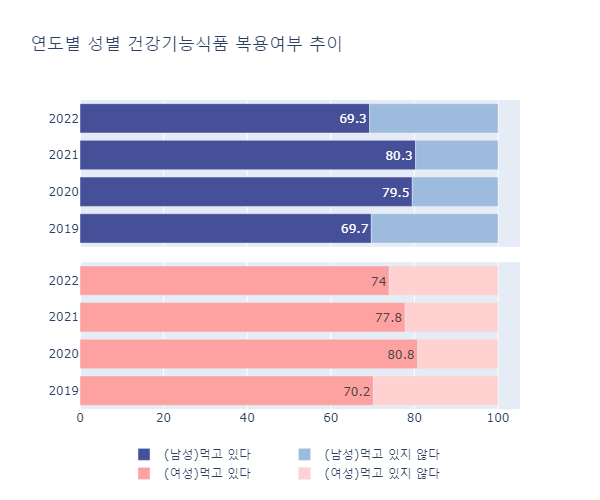

# 건강기능식품 복용 분석


<br>

## 1. 프로젝트 목적
- **팀 목표** : 사용자들에게 효과적인 섭취를 위한 건강기능식품 정보 제공 및 추천
- **개인 목표** : 가설검증 기법으로 건강기능식품 복용 행태 분석

<br>

## 2. 프로젝트 기간 및 참여인원
📅 2023.07.18~2023.07.24 (**7일**) / 👥 5명

<br>

## 3. 담당 역할
- 질병과의 건강기능식품 복용 간의 연관성 파악
- 가설검증 EDA 진행
  - **가설 ① : _코로나19의 영향으로 높아진 건강의 관심이 이어지고 있다_**
    - 국내 건강기능식품 시장은 2018년 부터 2022년까지 계속 상승세를 이어오고 있으며, 22년도에는 전년대비 15% 성장률 달성
    - 성별 및 연도별 복용 추이는 공통적으로 코로나 19 발현 연도인 2020년에 증가했다가 2022년에 하락하는 추세가 보임
    - **[결론]** 코로나 19의 영향으로 높아진 건강의 관심도가 이어지고 있지 않음으로 판단됨
      
      <div style="display: flex;">
        
        
      </div>
    
  - **가설 ② : _다빈도 약국 처방 질병과 건강기능식품 소비에 연관성이 있다_**
    - 여성 취약 질병군(소화계통/호흡계통/피부)에 발효미생물류의 건강기능식품이 효과가 있음
    - 남성대비 여성의 발효미생물류 구입 비중이 높음
    - **[결론]** 성별에 한해, 다빈도 약국처방 질병과 건강기능식품 소비에 연관성이 있음으로 사료됨
       

<br> <br> <br>  

> **웹사이트 시작하기** <br>
커널 창에서 아래 명령어를 입력하면 웹서버가 시작됩니다:
```bash
python manage.py runserver
```
> 웹서버가 시작된 후에는 [http://127.0.0.1:8000/nonmodel/about/](http://127.0.0.1:8000/nonmodel/about/) 링크로 접속하여 웹사이트를 이용할 수 있습니다.

